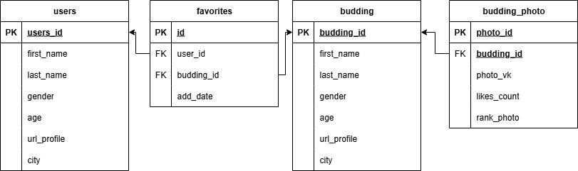

# VKinder Bot - Бот для знакомств ВКонтакте

## Описание
Бот для поиска потенциальных партнеров в социальной сети ВКонтакте. Основные возможности:
- Поиск кандидатов по заданным параметрам (возраст, город, интересы)
- Просмотр профилей и фотографий кандидатов
- Добавление понравившихся кандидатов в избранное
- Черный список для исключения неподходящих кандидатов
- Система оценки совпадения по интересам и группам

## Технологии
- Python 3.10+
- VK API (для работы с социальной сетью)
- PostgreSQL (хранение данных пользователей и кандидатов)
- SQLAlchemy (ORM для работы с базой данных)
- Pydantic (валидация данных)

## Установка и настройка

### 1. Требования
- Аккаунт ВКонтакте с созданным сообществом
- Доступ к серверу PostgreSQL

### 2. Настройка окружения
Создайте файл `.env` в корне проекта на основе `.env.example`:
```ini
# Database
DB_NAME=vkinder_db
DB_USER=postgres
DB_PASSWORD=your_password
DB_HOST=localhost
DB_PORT=5432

# VK API
VK_TOKEN=your_group_token
GROUP_ID=your_group_id
```

### 3. Установка зависимостей
```commandline
pip install -r requirements.txt
```

### 4. Инициализация базы данных
```commandline
python -m src.db.create_db
```

## Запуск бота
`python -m src.main`

## Команды бота

### Основные команды:
- **Старт**: `привет`, `начать`, `старт`  
  Запускает бота, показывает приветственное сообщение и главное меню

- **Помощь**: `помощь`, `help`  
  Показывает справку по использованию бота

- **Поиск пар**: `найти пару`, `поиск`  
  Начинает поиск потенциальных партнеров по заданным критериям

- **Избранное**: `избранное`, `favorites`  
  Показывает список сохраненных кандидатов

### Команды при просмотре кандидатов (интерактивные кнопки):
- ❤️ **В избранное**  
  Добавляет текущего кандидата в избранное

- 👎 **Чёрный список**  
  Добавляет кандидата в черный список (больше не будет показываться)

- 👍 **Лайк фото**  
  Ставит лайк текущей фотографии кандидата

- ➡️ **Следующий**  
  Показывает следующего кандидата в результатах поиска

### Управление избранным:
- **Удалить из избранного**  
  Удаляет последнего просмотренного кандидата из избранного

- **Назад**: `назад`, `отмена`  
  Возвращает в главное меню

### Формат команд:
- Все текстовые команды нечувствительны к регистру
- Можно использовать как текстовые команды, так и интерактивные кнопки
- При вводе неизвестной команды бот предложит помощь

## Структура проекта
```
adpy-team-diplom/
├── src/                      # Исходный код приложения
│   ├── bot.py                # Основная логика бота
│   ├── main.py               # Точка входа (запуск бота)
│   ├── vk_api_handler.py     # Взаимодействие с VK API
│   ├── db/                  # Работа с базой данных
│   │   ├── create_db.py     # Инициализация БД
│   │   ├── db_session.py    # Настройки сессии SQLAlchemy
│   │   ├── model_db.py      # Конфигурация подключения
│   │   ├── queries.py       # SQL-запросы и CRUD-операции
│   │   └── vkinder_models.py # Модели SQLAlchemy
│   └── __init__.py
├── tests/                   # Тесты
│   ├── integration/        # Интеграционные тесты
│   ├── unit/               # Юнит-тесты
│   └── conftest.py         # Фикстуры pytest
├── .env.example            # Шаблон конфигурации окружения
├── .gitignore              # Игнорируемые файлы (кэш, IDE и т.д.)
├── pytest.ini              # Конфигурация тестирования
├── requirements.txt        # Зависимости Python
└── README.md               # Документация проекта
```
## Работа с ботом
После запуска бот будет доступен в личных сообщениях вашего сообщества ВКонтакте. 

**Основные команды:**
- **Найти пару** - начать поиск кандидатов
- **Избранное** - просмотреть сохраненные анкеты
- **Помощь** - показать справку

**При просмотре кандидатов:**
- ❤️ **В избранное** - сохранить кандидата
- 👎 **Черный список** - исключить кандидата из поиска
- 👍 **Лайк фото** - поставить лайк фотографии
- ➡️ **Следующий** - перейти к следующему кандидату

## Схема базы данных


## Настройка тестирования
Конфигурация **pytest** находится в файле `pytest.ini`:
```ini
[pytest]
testpaths = tests
python_files = test_*.py
python_functions = test_*
addopts = -v --cov=src --cov-report=term-missing
```
Эта конфигурация:
* Указывает pytest искать тесты в директории tests
* Автоматически обнаруживает файлы с тестами по маске test_*.py
* Включает подробный вывод (-v)
* Активирует проверку покрытия кода (--cov) с отчетом о непокрытых строках (term-missing)

## Тестирование
Проект включает unit- и integration-тесты. 

Для запуска:
```commandline
pytest tests/ -v
```
С опцией покрытия кода:
```commandline
pytest --cov=src tests/
```

## Дополнительные возможности
1. **Система оценки совпадений:**
* Учитываются общие группы
* Совпадение по возрасту и городу
* Анализ интересов (музыка, книги, фильмы)
2. **Управление черным списком:**
* Возможность исключать неподходящих кандидатов
* Автоматическая фильтрация при поиске
3. **Топ фотографий:**
* Показ самых популярных фото кандидата
* Сортировка по количеству лайков

## Требования к API
Для работы бота необходим токен группы ВКонтакте с правами:
* **messages** (отправка сообщений)
* **photos** (просмотр фотографий)
* **groups** (проверка общих групп)
* **friends** (для расширенного поиска)


